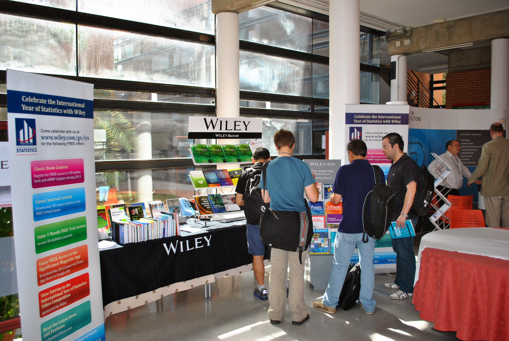
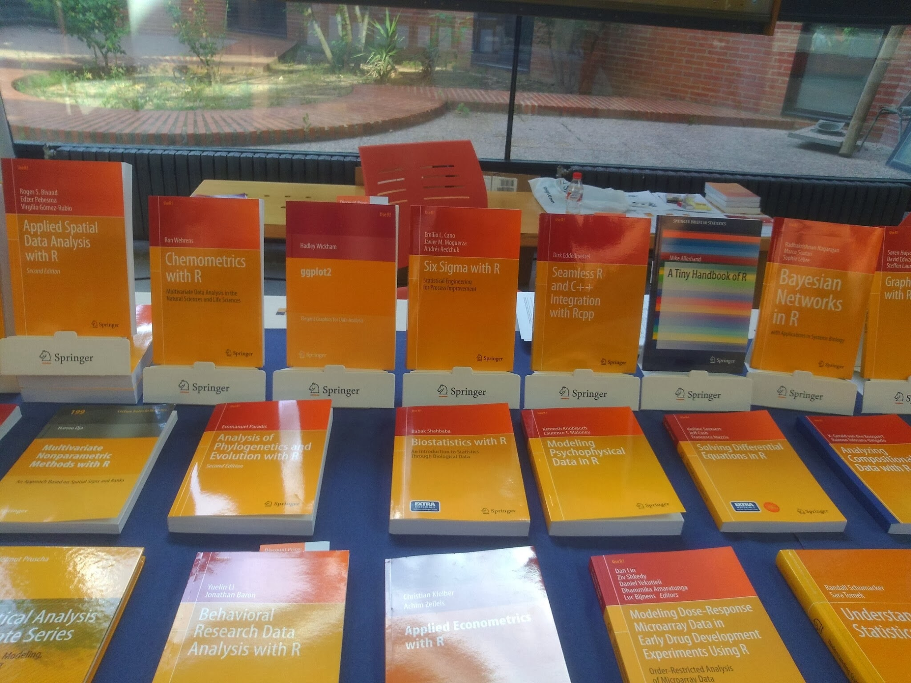
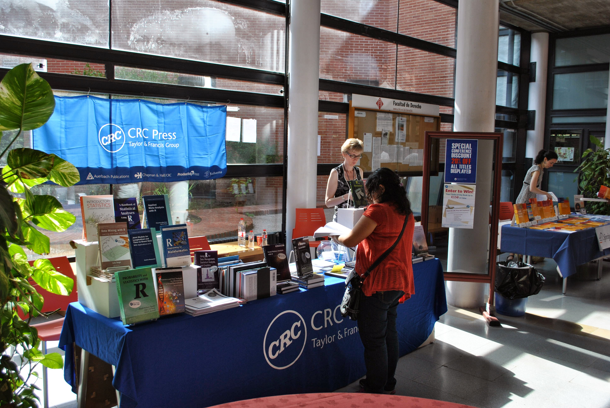
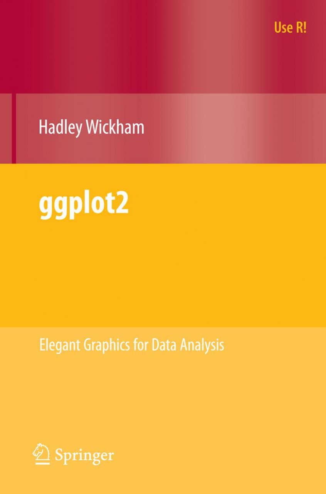
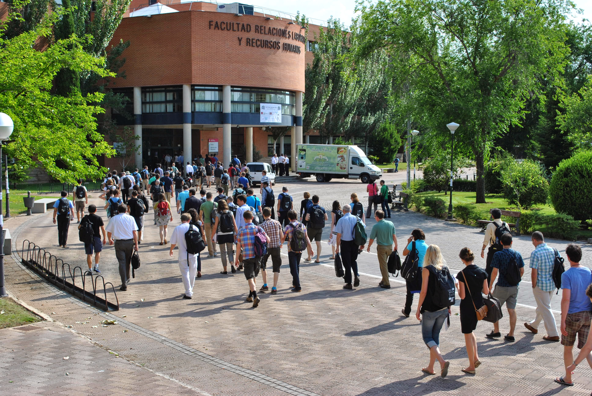
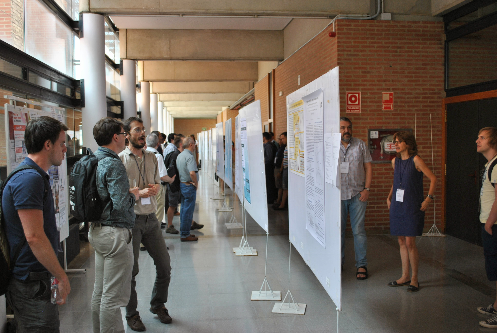

## Outline

<div class="columns-2">

  * Conference impressions
      + Tutorials
      + Talks
  
  * Code snippets
      + `Rcpp`
      
  * Outlook
  
   

</div>


# Conference impressions

## Tutorials | Tuesday
 
  - `Rcpp` and C++
  - `ggplot2`
  - Using spatial data
  - Classification with individual and ensemble trees
  - Interactive web graphics with R and `googleVis`
  - Cloud computing
  - ...
  
   </center>
   </center>
   </center>

## Tutorials | ggplot2

* written by Hadley Wickham
* implementation of the grammar of graphics
* combines the advantages of both base and lattice graphics

<center>  </center>

## Conference | Wednesday to Friday

 </center>
 </center>

## Conference | Talks
<div class="columns-2">
  * <b>Invited talks</b>
      - Duncan Murdoch
      - Hadley Wickham
      - Steve Scott  
        
  * <b>Contributed talks</b>
      - useR! Focus Sessions
      - useR! Lightning Talks
      - useR! Kaleidoscope
  
  
  
</div>

## Conference | Poster sessions
<div class="columns-2">
  * Bioinformatics
  * Econometrics
  * Ecological modeling
  * Marketing
  * Public policy
  * Social sciences
  * Statistics
  * ...
  
  
  
</div>

## Conference | Social life

<div class="columns-2">
  
  
  
  
</div>


# Code snippets

## Rcpp

* written by Dirk Eddelbuettel and Romain François
* seamless R and C++ integration
    + supports many R data types
    + provides typical R functions and C++ classes  

<center>  </center>

----

<font size="6"><b>Why use C++ integration in R?</b></font>
 
Sometimes, R code is just not fast enough...


----

* Loops that cannot be vectorized because subsequent iterations depend on 
previous ones

```{r count}
# Count number of remaining samples (iterations)

nLeft <- 3
for (i in 1:3) {
  cat("Processing sample ", i, ". ", sep = "")

  ## (some sample-related operations)
  
  ### <b>
  nLeft <- nLeft - 1
  ### </b>
  cat(nLeft, "samples left ...\n")
}
```

----

* Recursive function calls

```{r fibonacci}
# Fibonacci sequence

fibonacci <- function(x) {
  if (x < 2) {
    return(x)
  } else {
    ### <b>
    return(fibonacci(x-1) + fibonacci(x-2))
    ### </b>
  }
}

sapply(1:10, fibonacci)
```

----

<font size="6"><b>An example: the `sum` function</b></font>

<font size="5.5">  
  <li>Base-R approach</li>
</font>

```{r sum}
x <- 1:10000

sum(x)
```

----

<font size="6"><b>An example: the `sum` function</b></font>

<font size="5.5">  
  <li>Custom R approach</li>
</font>

```{r sumR}
sumR <- function(x) {
  
  total <- 0
  for (i in 1:length(x)) {
    total <- total + x[i]
  }
  
  return(total)
}

sumR(x)
```

## {.smaller}

<font size="6"><b>An example: the `sum` function</b></font>

<font size="5.5">  
  <li>`Rcpp` approach</li>
</font>

```{r sumC}
library(Rcpp)

cppFunction('double sumC(NumericVector x) {
            
  int n = x.size();
  double total = 0;
  
  for(int i = 0; i < n; ++i) {
    total += x[i];
  }
  
  return total;
}')

sumC(x)
```

----

<font size="6"><b>An example: the `sum` function</b></font>

<font size="5.5">  
  <li>Speed test</li>
</font>

```{r speed_test}
library(microbenchmark)

microbenchmark(sum(x), sumR(x), sumC(x), times = 1000L)
```


# Outlook

----


<font size="6">With <b>invited talks</b> by</font>

* Thomas Lumley (R Core Team)
* Adrian Baddeley (`spatstat`)
* Romain François (`Rcpp`)
* ...

(see http://user2015.math.aau.dk/)

## Side note

This `ioslides` presentation was entirely created from R Markdown v2. <br>
<br>
For further information, check out <br>
http://blog.rstudio.org/2014/06/18/r-markdown-v2/. 

<center>
  
</center>

----

<center>
  
  <font size="6">Thank you for your attention!</font>
</center>
