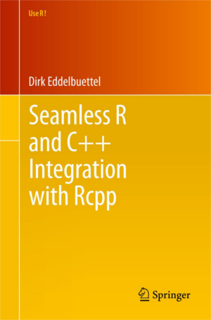

The R User Conference 2013
========================================================
author: Insa Otte, Florian Detsch
date: October 23, 2014

Outline
========================================================

* Time schedule

* Code snippets
  + `ggplot2`
  + `Rcpp`
  
* Outlook

Time schedule
========================================================

Rcpp
========================================================

* written by Dirk Eddelbuettel and Romain Francois
* seamless R and C++ integration
  + supports many R data types
  + provides typical R functions and C++ classes  

<center>  </center>

Rcpp
========================================================
title: false 

**Why use C++ integration in R?**  

Sometimes, R code is just not fast enough...

* loops that cannot be vectorized because subsequent iterations depend on 
previous ones


```r
# Count interations

for (i in 1:10) {
  if (i == 1) {
    nIter <- i
  } else {
    nIter <- nIter + 1  
  }
}
```

Rcpp
========================================================
title: false 

**Why use C++ integration in R?**  

Sometimes, R code is just not fast enough...

* recursive function calls


```r
# Fibonacci sequence

fibonacci <- function(x) {
  if (x < 2) {
    return(x)
  } else {
    return(fibonacci(x-1) + fibonacci(x-2))
  }
}

sapply(1:10, fibonacci)
```

```
 [1]  1  1  2  3  5  8 13 21 34 55
```

Rcpp
========================================================
title: false

**An Example: the `sum` function**


* Base-R approach

```r
x <- 5
y <- 10

sum(x, y)
```

```
[1] 15
```

Rcpp
========================================================
title: false

**An Example: the `sum` function**

* Manual R approach

```r
sumR <- function(x, y) {
  return(x + y)
}

x <- 5
y <- 10

sumR(x, y)
```

```
[1] 15
```

Rcpp
========================================================
title: false

**An Example: the `sum` function**

* `Rcpp` approach

```r
library(Rcpp)

cppFunction('double sumC(int x, int y) {
              return x + y;
            }')

x <- 5
y <- 10

sumC(x, y)
```

```
[1] 15
```

Rcpp
========================================================
title: false

**An Example: the `sum` function**


```r
all(identical(sum(x, y), sumR(x, y)), 
    identical(sum(x, y), sumC(x, y)))
```

```
[1] TRUE
```

Final
========================================================
title: false

<center>


Thank you for your attention!
</center>
